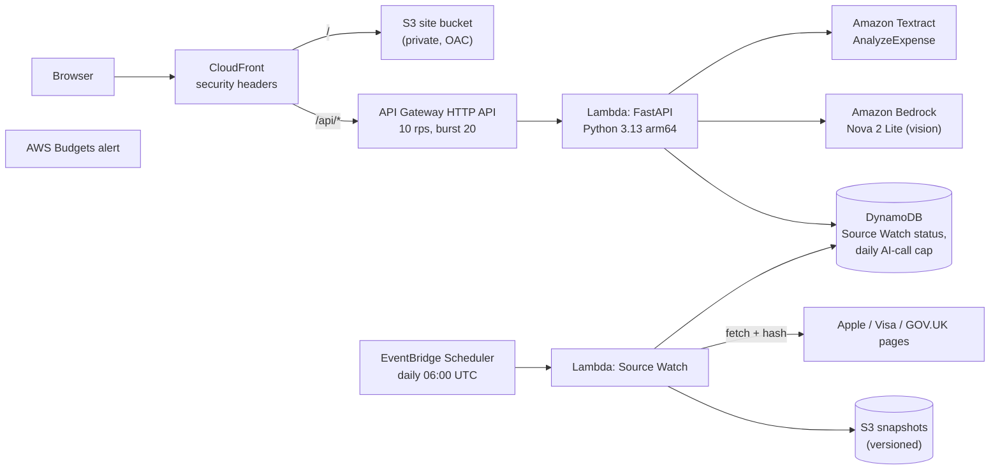

# RemedyAI: find the free repair or refund you may still be owed after your warranty ends

**Live:** https://d1fnfajqesgvsl.cloudfront.net (no sign-up)

RemedyAI checks a broken product against the published source for each repair or refund route it knows (manufacturer service programs, payment-card warranty benefits, consumer law), shows why it matched and what could stop it, and prepares a claim PDF. It only reports a route when a verified source record matches; otherwise it returns `NO VERIFIED COVERAGE FOUND`. Every source is re-checked daily by **Source Watch**.

Built for the **AWS Zero to Shipped** hackathon. Tags: `#daily-life-enhancement` `#startups`. Full writeup: [`docs/SUBMISSION.md`](docs/SUBMISSION.md).

## How a determination is made
- A route needs a source record in `backend/knowledge/`. No record, no route.
- Program and limitation windows are measured against the **claim date** (`evaluation_date`, default today). A closed window becomes a note, never a match.
- Invalid dates (failure before purchase, or in the future) are rejected.
- Source Watch status is applied on every evaluation: a route whose source page is unreachable, or whose Apple program has left Apple's index, is downgraded to `NEEDS_REVERIFICATION`.
- AI only reads: Amazon Textract reads receipts, Amazon Bedrock describes photos. Neither decides coverage. When no image is analysed, no observations are invented. Demo data is labelled as sample data.

## Source corpus

| Record | Source | Human check | Notes |
| :--- | :--- | :--- | :--- |
| iPhone 14 Plus Service Program for Rear Camera Issue | [Apple](https://support.apple.com/iphone-14-plus-service-program-for-rear-camera-issue) | 2026-09-29 | On Apple's index. Units made Apr 10, 2023 to Apr 28, 2024. 3 years from first retail sale. Serial check required. Refund possible if already paid. |
| iPhone 12 / 12 Pro Service Program for No Sound Issues | [Apple](https://support.apple.com/en-in/iphone-12-and-iphone-12-pro-service-program-for-no-sound-issues) | 2026-09-29 | Page live, **not on Apple's index**. Nearly all units past the window. |
| Visa Infinite Extended Warranty Protection | [Visa](https://www.visa.com/en-us/personal/cards/credit/visa-infinite) | 2026-09-29 | +1 year on eligible warranties of 3 years or less. Issuer's Guide to Benefits governs limits and deadlines. |
| UK consumer rights on faulty goods | [GOV.UK](https://www.gov.uk/accepting-returns-and-giving-refunds) | 2026-09-29 | Up to 6 years to claim (5 in Scotland). After 6 months the retailer can ask you to prove the fault existed at purchase. |

## Architecture



Everything is one AWS SAM template (`template.yaml`).

## Run locally
```bash
cd backend
pip install -r requirements-dev.txt
python -m pytest tests -q                    # 42 tests
python -m uvicorn src.app:app --port 8080    # use another port if 8080 is taken; update frontend/vite.config.ts
```
```bash
cd frontend && npm install && npm run dev    # http://localhost:3000, proxies /api to 127.0.0.1:8080
```
Install `node_modules` from the same OS you run Vite on (Windows and WSL need separate installs).

## Deploy
From WSL/Linux with the AWS CLI and SAM CLI configured:
```bash
./scripts/build_lambda.sh                       # arm64 wheels for Python 3.13
(cd frontend && npm run build)
ALERT_EMAIL=you@example.com ./scripts/deploy.sh # validate, deploy, upload site, run Source Watch, smoke test
python3 scripts/e2e_live.py https://<distribution>.cloudfront.net   # end-to-end incl. Textract + Bedrock
python3 scripts/export_cloudtrail.py --user <iam-user> --since YYYY-MM-DD
```
Each deploy writes a log to `docs/evidence/`.

## Disclaimer
RemedyAI prepares claims. It is not legal advice and does not guarantee coverage. The manufacturer, card issuer or retailer makes the final decision.
