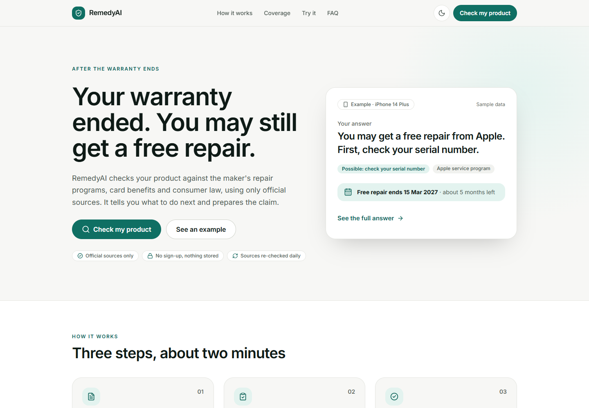
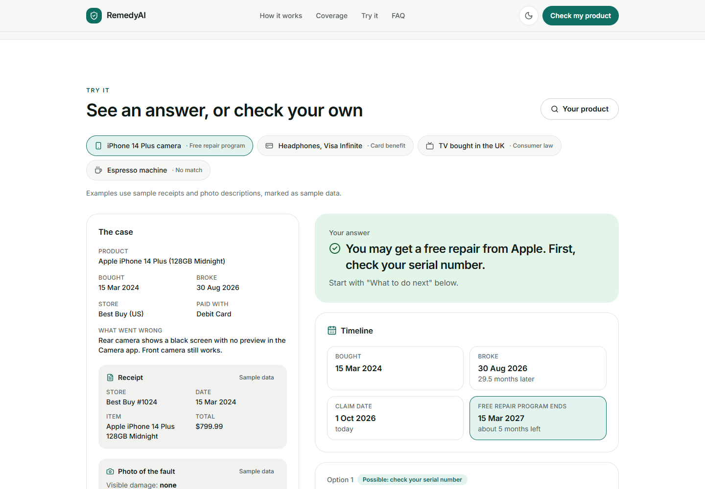
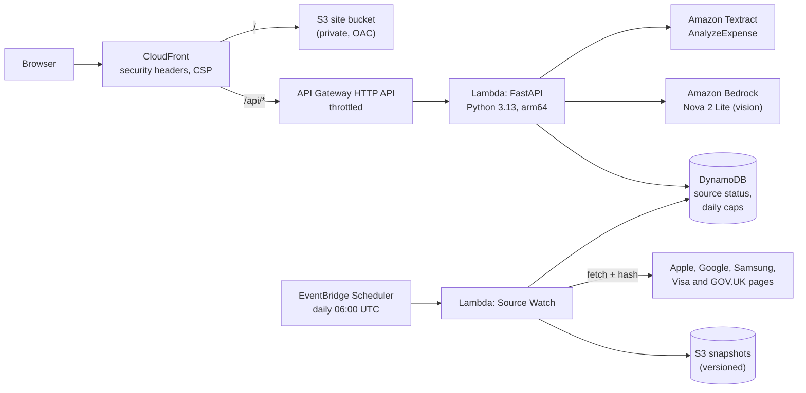

# RemedyAI

**Your warranty ended. You may still get a free repair.**

[](https://github.com/Extraordinarytechy/remedy-ai/actions/workflows/ci.yml)
[](https://d1fnfajqesgvsl.cloudfront.net)
[](#architecture)

RemedyAI checks a broken product against official sources (the maker's warranty and free repair
programs, card warranty benefits and consumer law), tells you what to do next, and prepares the
claim. It only answers from an official source that has been verified, re-checks every source daily, and says
so when nothing covers you.

**Try it:** https://d1fnfajqesgvsl.cloudfront.net · no sign-up · your details aren't saved



## What it covers today

| Option | Who | Source |
| --- | --- | --- |
| Apple One (1) Year Limited Warranty: iPhone (incl. iPhone 18 Pro), iPad, iPod, Apple TV, HomePod, Vision Pro | Apple, U.S. | [Apple](https://www.apple.com/legal/warranty/products/ios-warranty-document-us.html) |
| Apple One (1) Year Limited Warranty: Mac (MacBook Air, MacBook Pro, iMac, Mac mini, Mac Studio, Mac Pro) | Apple, U.S. | [Apple](https://www.apple.com/legal/warranty/products/embedded-mac-warranty-us.html) |
| Apple One (1) Year Limited Warranty: Apple Watch (not Apple Watch Edition) | Apple, U.S. | [Apple](https://www.apple.com/legal/warranty/products/warranty-us.html) |
| Apple One (1) Year Limited Warranty, Accessory: AirPods, AirTag, Apple Pencil, Magic Keyboard and other Apple accessories | Apple, U.S. | [Apple](https://www.apple.com/legal/warranty/products/accessory-warranty-english.html) |
| Mac mini (2023, M2) Service Program for No Power Issue | Apple | [Apple](https://support.apple.com/mac-mini-2023-service-program-for-no-power-issue) |
| iPhone 14 Plus Service Program for Rear Camera Issue | Apple | [Apple](https://support.apple.com/iphone-14-plus-service-program-for-rear-camera-issue) |
| iPhone 12 / 12 Pro no-sound program (ended; kept to show delisting) | Apple | [Apple](https://support.apple.com/en-in/iphone-12-and-iphone-12-pro-service-program-for-no-sound-issues) |
| Google Consumer Hardware Limited Warranty: Pixel phones, tablets, watches and earbuds, first year | Google, U.S. and Canada | [Google](https://support.google.com/product-documentation/answer/12461608?hl=en) |
| Pixel 9 Pro & 9 Pro XL Extended Repair Program: vertical display line (or flicker on 9 Pro), 3 years | Google | [Google](https://support.google.com/pixelphone/answer/16737524?hl=en) |
| Samsung Care 12-month built-in limited warranty: Galaxy phones, including Fold and Flip | Samsung, U.S. | [Samsung](https://www.samsung.com/us/explore/care/game-changing-phone-repair-that-walks-the-walk/) ([terms](https://www.samsung.com/us/support/legal/LGL10000282/)) |
| Visa Infinite Extended Warranty Protection: +1 year on warranties of 3 years or less | Any brand, U.S. | [Visa](https://www.visa.com/en-us/personal/cards/credit/visa-infinite) |
| UK consumer rights on faulty goods: up to 6 years to claim (5 in Scotland) | Any brand, UK | [GOV.UK](https://www.gov.uk/accepting-returns-and-giving-refunds) |

Each option is one JSON record in [`backend/knowledge/`](backend/knowledge), and the site's coverage
list is built from those same records. The UK and Visa Infinite options cover any brand, including TVs
and home appliances. A new manufacturer warranty or repair program is only a record: the two Google
options and Samsung's warranty were added as JSON files with no brand-specific code. A new card network or country's consumer
law also needs a small evaluator.

## How it works



1. **The user describes the case**: product, dates, store, payment and the fault. Receipt and fault
   photos are optional; Amazon Textract and Amazon Bedrock *read* them, and the user reviews
   what was read.
2. **A deterministic engine** ([`eligibility.py`](backend/src/engine/eligibility.py)) matches the
   case against the records. Windows are measured against the claim date; a closed window becomes
   a note, never a match. AI never decides coverage. Dates that can't be right are refused: a
   purchase more than 30 years before the claim date, or before the model (or the first phone of its
   family) went on sale (on-sale dates from the makers' own announcements, in [`backend/data/`](backend/data)). When nothing matches, the
   answer says why for each kind of option.
3. **Receipt checks** ([`case_checks.py`](backend/src/engine/case_checks.py)) compare the receipt
   with what was typed. A currency that doesn't fit the chosen country holds the consumer-law option
   and the claim PDF until the user confirms. A different receipt date also holds the claim PDF until the
   user confirms; a different store is a warning.
4. **The answer** leads with the next step, then the timeline and deadline (with a calendar file),
   what's needed, what could stop it, and the sources. A claim PDF and a draft letter are generated
   from the server's own evaluation.

**Source Watch** ([`source_watch.py`](backend/src/services/source_watch.py)) runs daily. It re-reads
every source (or just the exact sentence a record relies on), stores a snapshot when it changes, and
downgrades an option to "check it first" if its page disappears, the sentence a record relies on
disappears or changes after the record was last verified, an Apple program leaves Apple's list, or
Apple's list can't be read. It also reports any Apple repair program that has no record yet. Each run
publishes a `DegradedSources` CloudWatch metric, and an alarm emails the owner when anything needs
re-verifying; separate alarms cover a failed or missed run. Options marked "check it first" are never
used in the claim PDF or letter.

## Architecture



Everything is one AWS SAM template ([`template.yaml`](template.yaml)). Idle cost is close to zero;
the only paid calls are optional photo reads, capped per day overall and per visitor.

## Security and privacy

Nothing a user enters is stored, there are no accounts or cookies, and the AWS account is opted out
of AI services using content for service improvement. The claim PDF is built only from the server's
own evaluation, with all text escaped. Details: [`SECURITY.md`](SECURITY.md).

## Built with a coding agent

RemedyAI was built and deployed by **Kiro** working in a terminal connected to the AWS account.
[`docs/evidence/`](docs/evidence) holds the proof: a CloudTrail export of every API call made with
the agent's IAM user, the deploy logs and the latest end-to-end run against the live site. The full
project writeup is in [`docs/WRITEUP.md`](docs/WRITEUP.md).

## Run locally

```bash
cd backend
pip install -r requirements-dev.txt
python -m pytest tests -q                    # 337 tests
python -m uvicorn src.app:app --port 8082    # the Vite dev server proxies /api here
```

```bash
cd frontend
npm install
npm run dev                                  # http://localhost:3000
```

## Deploy

From Linux or WSL with the AWS CLI and SAM CLI configured:

```bash
./scripts/build_lambda.sh                          # arm64 wheels for Python 3.13
(cd frontend && npm run build)
ALERT_EMAIL=you@example.com ./scripts/deploy.sh    # validate, deploy, upload the site, run Source Watch, smoke test
python3 scripts/e2e_live.py https://<distribution>.cloudfront.net
```

Each deploy writes a log to `docs/evidence/`; run `python3 scripts/redact_evidence.py` before committing it.

## Repository layout

```
backend/
  knowledge/         one JSON record per verified source
  src/engine/        eligibility engine and receipt checks
  src/services/      Textract, Bedrock, claim PDF, Source Watch, usage caps
  tests/             pytest suite
frontend/            React + Vite + Tailwind site
scripts/             build, deploy, end-to-end and evidence scripts
docs/                writeup, screenshots and evidence
template.yaml        AWS SAM template for the whole stack
```

## Notices

RemedyAI prepares claims; it is not legal advice and does not guarantee coverage. It is not affiliated
with or endorsed by Apple, Google, Visa, Sony, Samsung, Best Buy, Currys, the UK Government or any company named. Contains public
sector information licensed under the
[Open Government Licence v3.0](https://www.nationalarchives.gov.uk/doc/open-government-licence/version/3/).
Copyright © 2026 Extraordinarytechy. All rights reserved; see [`LICENSE`](LICENSE).
