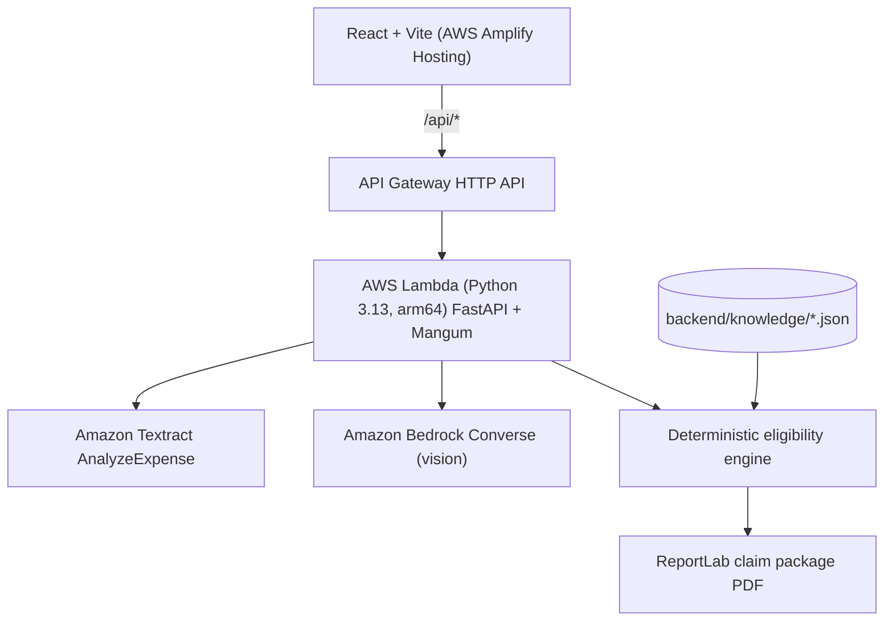

# RemedyAI: find the free repair or refund you may still be owed after your warranty ends

RemedyAI checks a broken product's purchase details against a curated set of primary sources (manufacturer service programs, payment-card warranty benefits, and consumer law) and prepares a claim package PDF. It only reports a route when a verified source record matches. Otherwise it returns `NO VERIFIED COVERAGE FOUND`.

Built for the **AWS Zero to Shipped Hackathon**. Tags: `#daily-life-enhancement` `#startups`.

> Status (2026-09-29): runs locally with 29 passing tests. **Not yet deployed to AWS.**

---

## How a determination is made

Every matched route carries a provenance chain shown in the UI and the PDF:

Claim → Why matched → Evidence → Source citation → Conditions → Exceptions

Rules the engine enforces:
- A route needs a source record in `backend/knowledge/`. No record, no route.
- Program and limitation windows are measured against the **claim date** (`evaluation_date`, defaults to today), not only the failure date. A window that already closed is reported as a note, never as coverage.
- Invalid dates (failure before purchase, failure in the future) are rejected.
- When no image is uploaded, or Bedrock is unavailable, no visual observations are invented.

## Source corpus

| Record | Source | Checked | Notes |
| :--- | :--- | :--- | :--- |
| iPhone 14 Plus Service Program for Rear Camera Issue | [Apple](https://support.apple.com/iphone-14-plus-service-program-for-rear-camera-issue) | 2026-09-29 | Listed on Apple's service-program index. Units made Apr 10, 2023 to Apr 28, 2024. 3 years from first retail sale. Serial check required. Refund possible if you already paid. |
| iPhone 12 / 12 Pro Service Program for No Sound Issues | [Apple](https://support.apple.com/en-in/iphone-12-and-iphone-12-pro-service-program-for-no-sound-issues) | 2026-09-29 | Page still live, but **no longer listed** on Apple's index. Nearly all units are past the 3-year window. |
| Visa Infinite Extended Warranty Protection | [Visa](https://www.visa.com/en-us/personal/cards/credit/visa-infinite) | 2026-09-29 | +1 year on warranties of 3 years or less. Claim limits and reporting deadline are **not** on this page; the issuer's Guide to Benefits governs. |
| UK Consumer Rights Act 2015 (goods) | [GOV.UK](https://www.gov.uk/accepting-returns-and-giving-refunds) | 2026-09-28 | 6-year limitation period in England and Wales. Not a 6-year warranty. |

## Demo cases (one click, sample data)

The receipt and photo blocks in the demo cases are hand-written sample data in Textract/Bedrock format, labelled as such in the UI. Real uploads go through `POST /api/intake`.

| Case | Expected result |
| :--- | :--- |
| iPhone 14 Plus, bought 2023-11-24, rear camera no preview | `PENDING_SERIAL_VERIFICATION` (window ends 2026-11-24) |
| Sony WH-1000XM5, Visa Infinite, hinge crack at ~18 months | `POTENTIALLY_ELIGIBLE` |
| Samsung TV bought in the UK 2023, panel lines at ~3 years | `POTENTIALLY_ELIGIBLE` with burden-of-proof caveat |
| Espresso machine, cash, fails at ~3 years | `NO VERIFIED COVERAGE FOUND` |

## Architecture



## Local development

Backend (from the repository root, Python 3.13):
```bash
pip install -r backend/requirements.txt
python -m pytest backend/tests -q
python -m uvicorn backend.src.app:app --port 8080 --reload
```
If port 8080 is taken, use another port and update `frontend/vite.config.ts`.

Frontend (install and run from the same OS you installed `node_modules` on):
```bash
cd frontend
npm install
npm run dev        # http://localhost:3000, proxies /api to 127.0.0.1:8080
```
For a deployed build, set `VITE_API_BASE_URL` to the API Gateway URL, or add an Amplify rewrite from `/api/<*>` to it.

## Deployment (not done yet)

```bash
sam build
sam deploy --guided --parameter-overrides BedrockModelId=<active vision model or inference profile id>
```
Known blocker: `template.yaml` uses `CodeUri: ./`, but dependencies live in `backend/requirements.txt`, so `sam build` will not package them. Fix before deploying.

## Disclaimer

RemedyAI is a claim-preparation tool. It does not give legal advice or guarantee coverage. The manufacturer, card issuer, or retailer makes the final decision.
